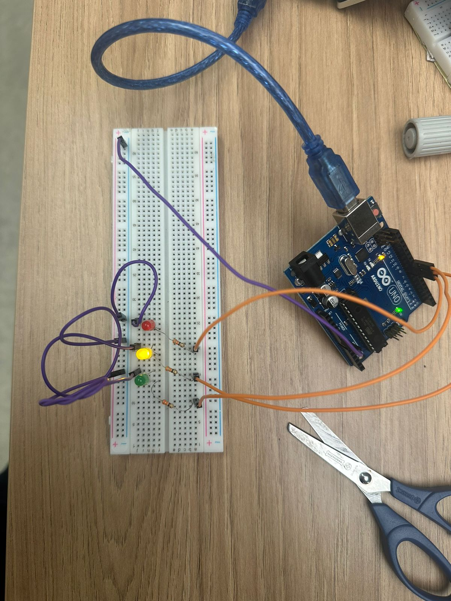

# Semáforo
#### Nome: Leonardo Martins
#### Grupo: 4
#### Ateliê: 12
#### Data de Entrega: 31/10/2024

### Descrição do Protótipo
Protótipo feito com jumpers laranjas indicando positivo e roxos indicandi negarivo. Os pinos selecionados foram o 8, 9 e 10  que estão conectados respectivamente nos LED's vermelho, amarelo e verde. A corrente eletrica flui pela protoboard, passa por resistores de 330 Ohm's e por fim são conduzidos por fios roxos para o GND do Arduino. A lógica do semáforo é composta pelos seguintes intervalos de tempo:
- 6 segundos no vermelho
- 2 segundos no amarelo
- 4 segundos no verde
- 2 segundos no amarelo
Repete o ciclo...

### Foto do Protótipo



### Vídeo do Protótipo

O Vídeo ["Semáforo"](https://youtube.com/shorts/o8TgaNryMfY?feature=share) mostra o funcionamento do semáforo.


#### Tabela de Avaliação entre Pares

#### Avaliador: Moyses Anijar

|Critério|	Contempla (Pontos)|	Contempla Parcialmente (Pontos)	|Não Contempla (Pontos)	|Observações do Avaliador|
|-|-|-|-|-|
|Montagem física com cores corretas, boa disposição dos fios e uso adequado de resistores	|X	|-	|- |3 pontos |	
|Temporização adequada conforme tempos medidos com auxílio de algum instrumento externo	|X	|-	|- |3 pontos |	
|Código implementa corretamente as fases do semáforo e estrutura do código (variáveis representativas e comentários) |	X|	- |	- |3 pontos |	
|Ir além: Implementou um componente de extra, fez com millis() ao invés do delay() e/ou usou ponteiros no código |	X |	- |	- |1 ponto |	
| | | | |Pontuação Total: 10|

### Código

```ino
#define green 10
#define yellow 9
#define red 8
unsigned long time;
unsigned long currentTime;
void setup() {
  // put your setup code here, to run once:
  Serial.begin(9600);
  pinMode(green, OUTPUT);
  pinMode(yellow, OUTPUT);
  pinMode(red, OUTPUT);
  digitalWrite(red, LOW);
  digitalWrite(yellow, LOW);
  digitalWrite(green, LOW);
  time = millis();
}
void loop() {
  currentTime = millis() - time;
  if(currentTime <= 6000){
    digitalWrite(yellow, LOW);
    digitalWrite(red, HIGH);
  }
  else if(currentTime > 6000 && currentTime <= 8000){
    digitalWrite(red, LOW);
    digitalWrite(yellow, HIGH);
  }
  else if(currentTime > 8000 && currentTime <= 14000){
    digitalWrite(yellow, LOW);
    digitalWrite(green, HIGH);
  }
  else if(currentTime >= 14000 && currentTime <= 16000) {
    digitalWrite(green, LOW);
    digitalWrite(yellow, HIGH);
  }
  else {
    time = millis();
  }
}

```
